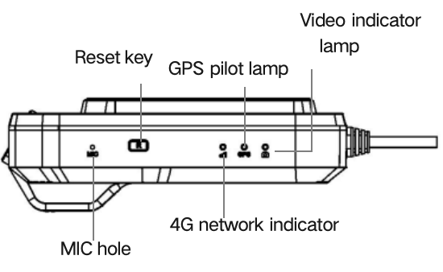
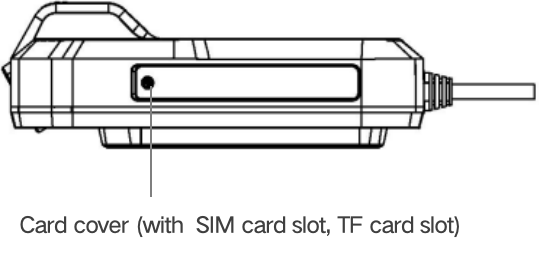
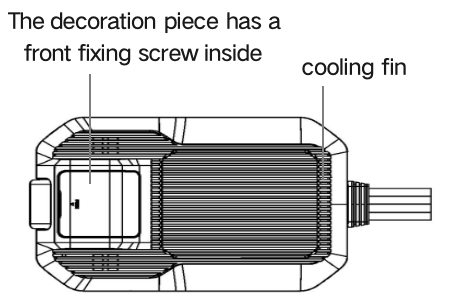
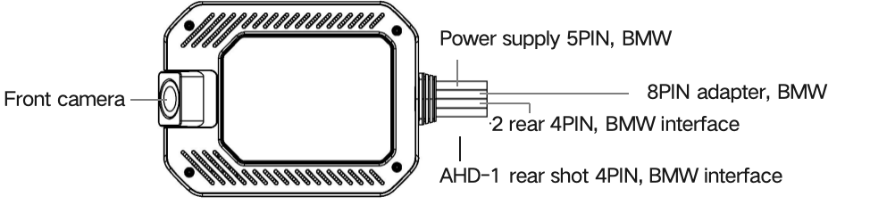
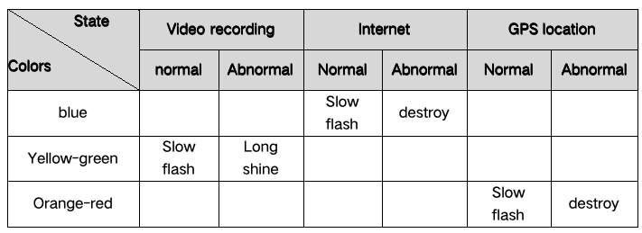
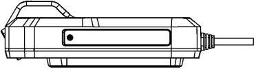
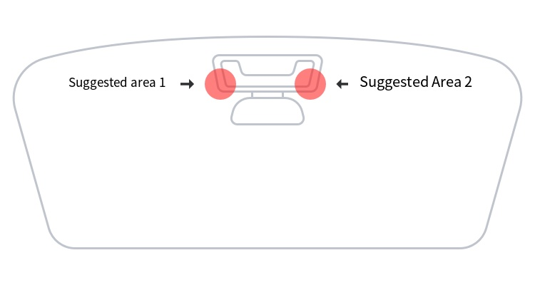
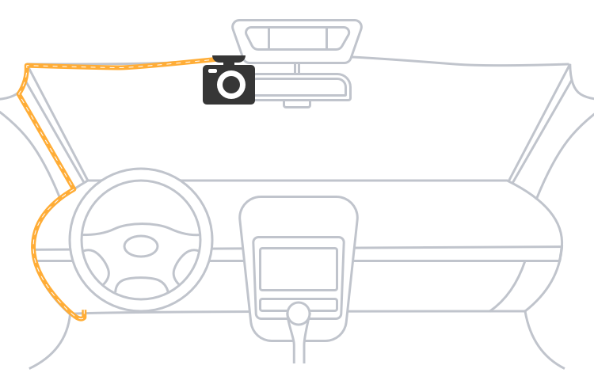
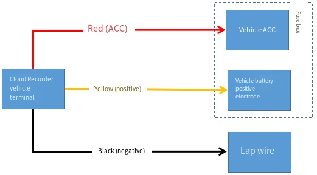

# D501 Product Manual

> The D501 Vehicle Networking Recorder is a high-performance, automotive-grade device designed for fleet management and vehicle monitoring. It integrates advanced ADAS/DMS algorithms, supports multi-channel cloud video storage, 4G/5G communication, and centimeter-level high-precision positioning, ensuring superior safety and operational efficiency for various commercial vehicle applications.

## 1. Overview

### 1.1 Product Overview

The D501 Vehicle Networking Recorder is engineered to meet the demanding requirements of various industries. Utilizing a professional, high-performance automotive-grade image processing chip and Linux operating system, it operates reliably in industrial environments with temperatures ranging from -20°C to 70°C. It integrates advanced Driver Assistance Systems (ADAS) and Driver Monitoring Systems (DMS). Leveraging AI variable frame technology, the D501 supports comprehensive cloud storage for multi-channel video. It also features 4G/5G full-network communication and RTK centimeter-level high-precision positioning.

### 1.2 Key Features

- Supports 2K + two 1080p video streams
- Automotive-grade chip with an industrial-grade operating temperature range of -20°C to 70°C
- AI variable frame video cloud storage technology for comprehensive multi-channel video cloud storage
- 4G/5G full-network communication
- BDS/GPS/RTK centimeter-level high-precision positioning
- Integrated ADAS/DMS/BSD algorithms
- Supports remote and automatic ADAS calibration, real-time fault tracking, remote parameter configuration, and more
- Complies with Ministry standards 794, 808, and other relevant protocol standards
- Supports vehicle 9-36V wide voltage input with comprehensive circuit protection (undervoltage, short circuit, reverse polarity)

## 2. Product Details

### 2.1 Product Advantages

| Advantages   | Details     |
| :--------------------- | :--------- |
| Ultra-Clear Picture Quality | Supports up to 2K + two 1080p or 2K + 1080p + two 720p ultra-definition video quality. It utilizes H.265 encoding and TS video streaming format to ensure picture clarity and stability.  |
| Cloud Storage | Offers multi-channel continuous video cloud recording and key event video cloud storage, enabling users to conveniently playback and share videos online at any time for comprehensive vehicle monitoring.   |
| Industry Standards     | Complies with Ministry standards 794/808/1076/1078 and other protocol standards. Features intelligent operation and maintenance functions, including fault detection, remote parameter query, and settings, enhancing vehicle safety and management efficiency.   |
| 4G/5G Full-Network Communication | Supports 4G and 5G (optional) full-network communication, providing faster network connection speeds and more stable signal transmission for seamless real-time monitoring and data transmission.  |
| High-Precision Positioning | Supports GPS/Beidou-2/Beidou-3/GLONASS multi-mode positioning, with optional RTK high-precision positioning, to achieve high-accuracy positioning and vehicle trajectory tracking, improving vehicle management and safety monitoring. |
| Wide Voltage           | Supports vehicle 9-36V wide voltage input, featuring battery undervoltage, short circuit, and reverse polarity protection functions to ensure stable operation and safe use of the equipment. |
| DMS      | Equipped with a Driver Monitoring System (DMS) that detects driver behaviors such as eye-closed fatigue, yawning, smoking, phone calls, distraction, and occlusion, enabling timely identification of safety risks and improving driving safety.     |
| ADAS                   | Driver Assistance Systems (ADAS) include functions like lane departure warning, forward collision warning, safe distance warning, and pedestrian detection, providing intelligent driving assistance and effectively reducing the risk of traffic accidents.   |
| One-Button SOS Alert   | The one-button SOS alert function enables quick response to vehicle accidents and emergencies, ensuring timely assistance and rescue, thereby enhancing driving safety and protecting the driver/owner.    |

### 2.2 Product Specifications

| No | Item    | Specifications   |
| :------------ | :------------ | :------------ |
| 1        | Operating System         | Linux 4.19       |
| 2             | CPU                      | Quad-core Cortex-A7 1.5GHz    |
| 3             | Memory                   | 4Gb DDR + 4Gb NAND Flash   |
| 4             | NPU                      | 2.0 TOPS   |
| 5             | Extended Storage    | 1 TF card slot, supporting up to 512GB   |
| 6             | Video    | H.265 encoding, TS stream recording, codec capability: 5MP@30fps    |
| 7             | Audio   | G.711A encoding, supports recording, voice broadcast, and intercom   |
| 8             | Front Camera             | MIPI interface, supports 2560x1440@30fps   |
| 9             | Rear Camera              | Two AHD ports, supporting 1080P@25fps       |
| 10            | Video Data (Bitstream)   | 1080P: 25fps@4Mbps (Main Stream); 720P: 20fps@2Mbps (Main Stream); 720P/540P: 16fps@800Kbps (Sub Stream) |
| 11            | Communication Network    | 4G full-network support, 5G full-network support (optional), built-in antenna |
| 12            | SIM Card                 | 1 SIM slot (supports patch IC card or external Micro SIM card)             |
| 13            | Wi-Fi                    | 802.11b/g/n 2.4GHz, built-in antenna     |
| 14            | Sensor                   | Six-axis gyroscope      |
| 15            | Keys                     | 2 buttons: On-device reset button, external SOS button     |
| 16            | MIC                      | 1 high-sensitivity microphone      |
| 17            | Speakers                 | Built-in 8Ω/1W speaker    |
| 18            | Indicator Lights         | Three indicator lights for video recording, GPS positioning, and network status |
| 19            | Serial Port              | Optional 1-way RS232 serial port   |
| 20            | GPIO                     | Supports up to three GPIO channels     |
| 21            | Operating Voltage        | 9V~36V   |
| 22            | Operating Current        | 500mA at 12V    |
| 23            | Sleep Current            | 20mA at 12V      |

### 2.3 Basic Functions

| Product Functions    | Description  |
| :----------- | :--------- |
| Loop Video Recording       | Video recordings are categorized into ordinary and emergency videos, which are circularly overwritten on the TF memory card based on predefined capacity ratios.   |
| Event Snapshot             | Triggered by events or remote commands, supports capturing one or more pictures/videos and uploading them to the cloud. Captures include 7 seconds before and 8 seconds after the event.   |
| Event Cloud Storage        | Snapshots or event-triggered pictures/videos are uploaded to the cloud for permanent storage.    |
| Emergency Video            | When an event is triggered, the current video file is locked as an emergency video. Snapshots or the video segment (7 seconds pre-event, 8 seconds post-event) are uploaded to the cloud.      |
| Remote Live Streaming      | Supports viewing one or more real-time video feeds on a mobile phone or platform.   |
| Remote Access              | Supports playback of one or more historical videos on a mobile phone or platform.   |
| Wi-Fi Preview              | Supports real-time video preview on a mobile phone via vehicle Wi-Fi connection.    |
| Wi-Fi Playback             | Supports historical video playback on a mobile phone via vehicle Wi-Fi connection.     |
| Parking Monitoring         | After the vehicle is turned off, supports remote viewing of real-time footage or capture. In case of anomalies like vibration or collision, it can actively notify the mobile phone.                               |
| Route Tracking             | Periodically reports vehicle longitude, latitude, and other positioning information.    |
| Route Playback             | View the travel trajectory for a specific day or time period.   |
| Offline Data Upload        | When the vehicle is offline, up to 10,000 pieces of recent positioning data are stored and automatically uploaded once connected to the network.                                                                |
| Voice Monitoring           | The platform can remotely monitor audio from the vehicle.     |
| Voice Intercom             | The platform supports two-way voice intercom with the vehicle.     |
| Low Voltage Alarm          | When the vehicle voltage drops below the preset threshold, a low voltage alert is reported, and the main unit's power supply is cut off.         |

### 2.4 Product Appearance

### 2.5 Exploded View of Product Structure

### 2.6 Product Dimensions

| Name          | Dimensions                    |
| :------------ | :---------------------------- |
| D501 Main Unit | 120 * 91 * 24.8 mm            |

### 2.7 Indicator Light Definitions

## 3. Installation Instructions

To ensure a smooth, efficient, and complete installation, please follow these steps:

- Determine the optimal wiring points, specifically locating the vehicle's fuse box and a suitable grounding point
- Identify the ideal mounting positions for the D501 recorder and other cameras
- Plan the wiring strategy: either integrate with the vehicle's existing wiring or opt for separate, discreet wiring
- Based on the above conditions, begin wiring from the driving recorder's installation location
- Once wiring is complete and power is confirmed, send installation pictures and relevant information to the backend personnel (if applicable) for data verification. After confirmation, reassemble the vehicle's trim panels, securely mount the driving recorder, and complete the installation

### 3.1 Installation Steps

**Installation Precautions:**

- Ensure the installation is firm and waterproof. Avoid high-temperature areas and sources of magnetic interference (e.g., car CD players, audio speakers, car computers, car radio)
- Ensure the installation location on the windshield is within the wiper's range to maintain clear visibility, even in rainy conditions. It should be positioned close to the rearview mirror for an optimal field of view
- Do not touch the lens with your fingers, as oils can leave smudges, leading to blurry video or distorted images
- During installation, ensure all plug interfaces are correctly and securely connected. For added protection, wrap connections with electrical tape to prevent water ingress, oxidation, and accidental dislodgement. Ensure wiring is concealed to avoid obstructing the driver's view and maintain aesthetic appeal

#### Step 1: Insert Cards

Insert the TF card and SIM card into the device, then secure the card cover.

#### Step 2: Select Installation Point

Select a suitable installation point for the main unit. Clean the area thoroughly. Peel off the protective film from the 3M adhesive on the recorder's bracket and firmly attach the bracket to the windshield, holding it in place for 2 minutes.

#### Step 3: Route Power Harness

Remove the decorative trim panel from the installation area. When routing the power harness, guide it along the A-pillar as indicated for common vehicle models.

*Figure 9: Typical Wiring Path (If actual conditions differ, choose a reasonable location for wiring)*

#### Step 4: Secure Front Camera

Once the front camera's angle is set, secure it by fastening the screw under its cover plate. This prevents vibration or accidental adjustment of the lens direction during vehicle operation.

*Figure 10: Securing the Front Camera*

#### Step 5: DMS Camera Installation

The DMS camera installation position should adhere to the following principles:

- **Installation Location:** Recommended to install on the center console or dashboard
- **Installation Angle & Distance:** Ensure the driver is within a ±30° range of the camera's front view. The recommended angle should be as small as possible. The recommended distance between the camera and the driver's face is 60-120cm, ideally around 80cm
- **Facing Centered:** Ensure the driver's face is centered within the DMS camera's field of view (can be confirmed via the mobile phone APP)
- **No Obstruction:** Ensure the DMS camera does not obstruct the driver's line of sight or interfere with driving
- **Clear View:** Ensure no objects, such as the steering wheel, obstruct the view between the DMS camera and the driver's face
- **Horizontal Alignment:** The DMS camera should be installed horizontally and not tilted
- **Optimal Angle:** Under the above conditions, the smaller the deviation angle between the DMS camera and the driver's face, the better. Ideally, it should point directly at the driver

### 3.2 Wiring Instructions

Route the power cord to the fuse box. Connect the ACC wire and the constant power wire to the appropriate fuse slots. Connect the GND wire directly to a suitable grounding point (e.g., a metal bolt on the vehicle's chassis).

**Wiring Instructions**

| No | Wire Color | Description                        |
| :-- | :--------- | :--------------------------------- |
| 1  | Yellow     | Power Supply Positive (B+)         |
| 2  | Black      | Power Connector Negative (GND)     |
| 3  | Red        | ACC (Accessory/Ignition Switch Control) |

**Wiring Precautions:**

- Remove the original vehicle's corresponding fuse and replace it with the power cord's fuse
- The device is typically equipped with a 15A fuse. Do not replace it with a fuse rated lower than 15A
- The ACC wire (red) controls the device's sleep/wake status. Do NOT connect the ACC wire to a constant power source
- The constant power wire connected to the positive pole (B+) should maintain at least 12V when the ignition is off

## 4. Application Fields and Target Users

| Category          | Details      |
| :------------------------ | :------ |
| Application Domain  | Internet of Vehicles (IoV) Industry    |
| Typical Use Cases    | Taxis, online ride-hailing services, passenger vehicles, freight vehicles, urban logistics, engineering vehicles, etc.      |
| Target Users         | Taxi/Ride-hailing/Freight/Passenger Vehicle Management Departments, Car Rental Companies, Fleet Managers, etc.   |
| Addressing Challenges | The D501 provides users with visual and intelligent management capabilities, enabling centralized remote monitoring, remote management, and comprehensive vehicle data acquisition and analysis. This allows for real-time monitoring of vehicle and driver status, helping to prevent fatigued driving, reduce accident risks, and ensure the safety of both drivers and vehicles. |

## 5. FAQ

| Issue/Problem     | Solution     |
| :---------------------- | :---------- |
| Device Detachment                  | Ensure the car glass is thoroughly cleaned, and the 3M adhesive tape is firmly pressed. If necessary, replace the 3M adhesive.  |
| Recorder Not Powering On           | Please confirm that the main power cable (e.g., BMW interface) is securely inserted and that the power cord is correctly connected, ensuring the external power supply is functioning.    |
| Video Recording Not Starting After Power On | First, ensure the TF card is properly inserted. If not, reinsert the TF card after powering off the device. If these steps fail, format the TF card or replace it with a new one.    |
| Abnormal Recording Termination     | Please format the TF card or replace it with a TF card that meets the requirements (Class 10 or higher). |
| Blurred Video Picture              | Please ensure there are no stains on the vehicle's windshield.   Please ensure there are no stains or obstructions on the recorder's camera lens.    |
| Recorder Unresponsive              | Please disconnect the power supply and restart the recorder. Alternatively, press the device's reset button to automatically restart the recorder.              |
| Terminal Offline        | Check if the SIM card is overdue on payments; if so, contact your network operator to settle the bill.   Check if the SIM card has good contact: reinsert the SIM card.   If the vehicle is in a weak signal area, such as an underground parking lot or tunnel, move it to an area with better signal reception. |
| Terminal Not Locating              | Ensure the antenna connection interface is securely plugged in.   Check if the antenna's surface is facing upwards: Re-adjust the antenna's placement.   If the vehicle is in an underground parking lot, tunnel, or other non-signal area, drive out of that area.    |

## 6. Important Precautions

| No. | Precaution    |
| :-- | :----- |
| 1   | Electronic products require careful attention to waterproofing.        |
| 2   | Ensure your vehicle's battery remains sufficiently charged.   |
| 3   | It is recommended to power off the device when the ambient temperature exceeds its normal operating temperature range. 
| 4   | In underground parking lots, tunnels, or garages, GPS positioning signals and communication network signals may be affected, potentially preventing device monitoring. The device will automatically restore normal operation once the vehicle exits such areas.   |
| 5   | Do not attempt self-repair in case of abnormal conditions. Damage caused by connecting non-original accessories or disconnecting internal components is not covered by the manufacturer's warranty.  |
| 6   | Due to varying environmental and vehicle conditions, some functions may not be supported. Product performance may be enhanced through irregular firmware upgrades without prior notice.   |
| 7   | While this product can record and save images/videos of vehicle accidents, it does not guarantee the recording of all accident footage. Subtle collisions may not trigger the collision sensor, meaning footage might not be saved to the special event folder.    |
| 8   | Always turn off the device's power before inserting or removing the TF memory card.    |
| 9   | For stable product operation, it is recommended to format the memory card at least once every two weeks.   |
| 10  | TF cards have a limited service life. Prolonged use may lead to data corruption or an inability to save data. In such cases, it is recommended to purchase a new TF card. The company is not responsible for data loss due to prolonged use of the memory card or its natural wear-and-tear.  |
| 11  | Do not connect to an uninterruptible power supply (UPS) without authorization, as this may cause vehicle or product malfunction. For installation queries or professional assistance, please be sure to consult qualified professionals.      |
| 12  | This product is designed as a safe driving aid. All recorded data, including video and audio, serves only as an auxiliary reference. Our company shall not be held responsible for any malfunction or data loss resulting from improper operation of the device or external factors beyond our control.     |

