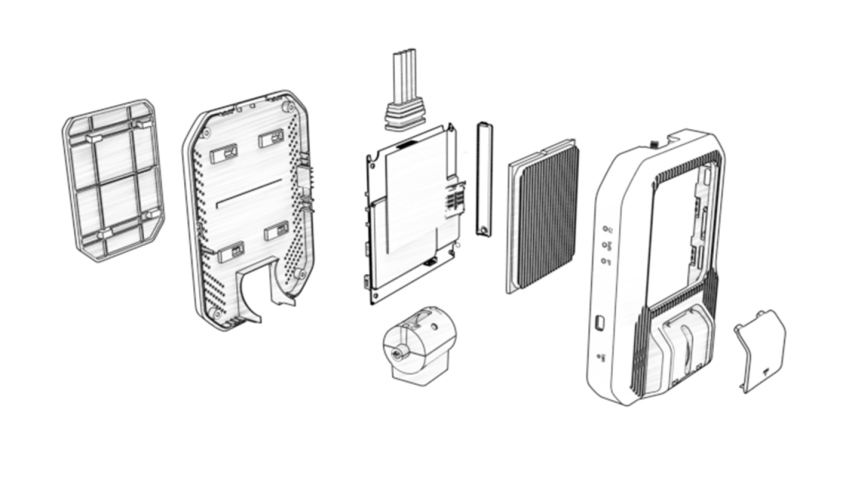

# Manual do Produto D501

> O gravador veicular IoT D501 é um dispositivo automotivo de alto desempenho projetado para gerenciamento de frota e monitoramento veicular. Integra algoritmos avançados ADAS/DMS, suporta armazenamento de vídeo em nuvem multi-canal, comunicação 4G/5G e posicionamento de alta precisão em nível de centímetros, fornecendo excelente segurança e eficiência operacional para várias aplicações de veículos comerciais.

## 1. Visão Geral do Produto

### 1.1 Introdução do Produto

O gravador veicular IoT D501 é projetado para atender demandas rigorosas em diversas indústrias. Adota chips de processamento de imagem automotivos profissionais de alto desempenho e o sistema operacional Linux, garantindo operação estável em ambientes industriais de -20°C a 70°C. Integra Sistemas Avançados de Assistência ao Motorista (ADAS) e Sistemas de Monitoramento do Motorista (DMS). Utilizando tecnologia de taxa de quadros variável AI, o D501 suporta armazenamento abrangente em nuvem de vídeo multi-canal. Também possui comunicação de rede completa 4G/5G e posicionamento de alta precisão RTK em nível de centímetros.

### 1.2 Recursos Principais

- Suporta streams de vídeo 2K + dual 1080p
- Chip automotivo, faixa de temperatura industrial de -20°C a 70°C
- Tecnologia de armazenamento em nuvem de vídeo com taxa de quadros variável AI para armazenamento abrangente em nuvem de vídeo multi-canal
- Comunicação de rede completa 4G/5G
- Posicionamento de alta precisão Beidou/GPS/RTK em nível de centímetros
- Algoritmos integrados ADAS/DMS/BSD
- Suporta calibração ADAS remota e automática, rastreamento de falhas em tempo real, configuração remota de parâmetros, etc.
- Em conformidade com os padrões do Ministério 794, 808 e padrões de protocolo relacionados
- Suporta entrada de tensão ampla 9-36V para veículos, com proteção completa de circuito (subtensão, curto-circuito, conexão reversa)

## 2. Detalhes do Produto

### 2.1 Vantagens do Produto

| Vantagem | Detalhes |
| :----- | :----- |
| Imagem Ultra-Clara | Suporta até 2K + dual 1080p ou 2K + 1080p + dual 720p de qualidade de vídeo ultra-clara. Usa codificação H.265 e formato de stream de vídeo TS para garantir imagens claras e estáveis. |
| Armazenamento em Nuvem | Fornece gravação em nuvem de vídeo contínuo multi-canal e armazenamento em nuvem de vídeo de evento-chave, permitindo aos usuários reproduzir e compartilhar vídeos online convenientemente a qualquer momento, alcançando monitoramento veicular abrangente. |
| Padrões da Indústria | Em conformidade com os padrões do Ministério 794/808/1076/1078 e outros padrões de protocolo. Possui capacidades inteligentes de O&M incluindo detecção de falhas, consulta e configuração remota de parâmetros, melhorando segurança veicular e eficiência de gerenciamento. |
| Comunicação de Rede Completa 4G/5G | Suporta comunicação de rede completa 4G e 5G (opcional), fornecendo velocidades de conexão de rede mais rápidas e transmissão de sinal mais estável, permitindo monitoramento em tempo real e transmissão de dados sem interrupções. |
| Posicionamento de Alta Precisão | Suporta posicionamento multi-modo GPS/Beidou Gen-2/Beidou Gen-3/GLONASS, com posicionamento de alta precisão RTK opcional, alcançando posicionamento de alta precisão e rastreamento de trajetória veicular, melhorando gerenciamento veicular e monitoramento de segurança. |
| Tensão Ampla | Suporta entrada de tensão ampla 9-36V para veículos, com funções de proteção de subtensão de bateria, curto-circuito e conexão reversa, garantindo operação estável do dispositivo e uso seguro. |
| Sistema DMS | Equipado com Sistema de Monitoramento do Motorista (DMS), capaz de detectar fadiga de olhos fechados, bocejo, fumo, chamadas telefônicas, distração, oclusão e outros comportamentos do motorista, identificando oportunamente riscos de segurança e melhorando segurança de direção. |
| Sistema ADAS | Sistema de Assistência ao Motorista (ADAS) inclui alerta de saída de faixa, alerta de colisão frontal, alerta de distância segura e funções de detecção de pedestres, fornecendo assistência de direção inteligente e reduzindo efetivamente riscos de acidentes de trânsito. |
| Alarme SOS de Um Botão | A função de alarme SOS de um botão permite resposta rápida a acidentes veiculares e emergências, garantindo assistência e resgate oportunos, melhorando assim a segurança de direção e protegendo motoristas/proprietários de veículos. |

### 2.2 Especificações do Produto

| Nº | Item | Especificações |
| :---- | :---- | :---- |
| 1 | Sistema Operacional | Linux 4.19 |
| 2 | CPU | Quad-core Cortex-A7 1.5GHz |
| 3 | Memória | 4Gb DDR + 4Gb NAND Flash |
| 4 | NPU | 2.0 TOPS |
| 5 | Armazenamento Estendido | 1 slot de cartão TF, suporta até 512GB |
| 6 | Vídeo | Codificação H.265, gravação stream TS, capacidade codec: 5MP@30fps |
| 7 | Áudio | Codificação G.711A, suporta gravação, transmissão de voz e intercomunicação |
| 8 | Câmera Frontal | Interface MIPI, suporta 2560x1440@30fps |
| 9 | Câmera Traseira | Duas portas AHD, suporta 1080P@25fps |
| 10 | Dados de Vídeo (Taxa de Bits) | 1080P: 25fps@4Mbps (stream principal); 720P: 20fps@2Mbps (stream principal); 720P/540P: 16fps@800Kbps (stream secundário) |
| 11 | Rede de Comunicação | Suporte completo 4G, suporte completo 5G (opcional), antena embutida |
| 12 | Cartão SIM | 1 slot de cartão SIM (suporta cartão IC plug-in ou cartão Micro SIM externo) |
| 13 | Wi-Fi | 802.11b/g/n 2.4GHz, antena embutida |
| 14 | Sensor | Giroscópio de seis eixos |
| 15 | Botões | 2 botões: Botão de reset do dispositivo, botão SOS externo |
| 16 | Microfone | 1 microfone de alta sensibilidade |
| 17 | Alto-falante | Alto-falante embutido 8Ω/1W |
| 18 | Luzes Indicadoras | Três luzes indicadoras para gravação de vídeo, posicionamento GPS e status de rede |
| 19 | Porta Serial | 1 porta serial RS232 opcional |
| 20 | GPIO | Suporta até três canais GPIO |
| 21 | Tensão de Operação | 9V~36V |
| 22 | Corrente de Operação | 500mA em 12V |
| 23 | Corrente de Sleep | 20mA em 12V |

### 2.3 Funções Básicas

| Função do Produto | Descrição |
| :---- | :---- |
| Gravação em Loop | A gravação de vídeo é dividida em gravação normal e gravação de emergência, substituída em loop no cartão de armazenamento TF de acordo com a proporção de capacidade predefinida. |
| Captura de Evento | Acionado por eventos ou comandos remotos, suporta capturar uma ou múltiplas imagens/vídeos e fazer upload para a nuvem. A captura inclui 7 segundos antes do evento e 8 segundos após o evento. |
| Armazenamento em Nuvem de Evento | Imagens/vídeos acionados por capturas ou eventos são feitos upload para a nuvem para armazenamento permanente. |
| Gravação de Emergência | Quando um evento é acionado, o arquivo de gravação atual é bloqueado como gravação de emergência. Imagens capturadas ou clipes de vídeo (7 segundos antes do evento, 8 segundos após o evento) são feitos upload para a nuvem. |
| Pré-Visualização em Tempo Real Remota | Suporta visualização de um ou múltiplos canais de vídeo em tempo real em celulares ou plataformas. |
| Reprodução Remota | Suporta reprodução de um ou múltiplos canais de vídeo histórico em celulares ou plataformas. |
| Pré-Visualização Wi-Fi | Suporta conexão a celulares via Wi-Fi veicular para pré-visualização de vídeo em tempo real. |
| Reprodução Wi-Fi | Suporta conexão a celulares via Wi-Fi veicular para reprodução de vídeo histórico. |
| Monitoramento de Estacionamento | Após o veículo ser desligado, suporta visualização remota de imagens em tempo real ou capturas. Se anormalidades como vibração ou colisão ocorrerem, o celular pode ser ativamente notificado. |
| Rastreamento de Trajetória | Reporta regularmente informações de posicionamento veicular como latitude e longitude. |
| Reprodução de Trajetória | Visualiza trajetórias de direção para um dia específico ou período de tempo. |
| Upload de Dados Offline | Quando o veículo está offline, armazena os 10.000 dados de posicionamento mais recentes e os faz upload automaticamente após o redes. |
| Monitoramento de Voz | A plataforma pode monitorar remotamente o áudio no veículo. |
| Intercomunicação de Voz | A plataforma suporta intercomunicação de voz bidirecional com veículos. |
| Alarme de Baixa Tensão | Quando a tensão do veículo é menor que o limite predefinido, reporta alarme de baixa tensão e corta a energia do host. |

### 2.4 Aparência do Produto

### 2.5 Vista Explodida do Produto

*Figura 5: Vista explodida do produto*

### 2.6 Dimensões do Produto

**Tabela 4: Dimensões do Produto**

| Nome | Dimensões |
| :---- | :---- |
| Host D501 | 120 * 91 * 24.8 mm |

*Figura 6: Diagrama de dimensões do produto*

### 2.7 Definições de Luzes Indicadoras

| Cor | Status | Gravação de Vídeo | Rede | Posicionamento GPS |
| :---- | :---- | :---- | :---- | :---- |
| Azul | Flash lento | Normal | Desligado | Desligado |
|  | Sólido | Desligado | Normal | Desligado |
| Amarelo-Verde | Flash lento | Desligado | Desligado | Normal |
| Laranja-Vermelho | Flash lento | Desligado | Anormal | Desligado |
|  | Sólido | Desligado | Desligado | Anormal |

## 3. Instruções de Instalação

Para garantir uma instalação suave, eficiente e completa, siga estas etapas:

- Determine o melhor ponto de fiação, especificamente localizando a caixa de fusíveis do veículo e um ponto de aterramento adequado
- Determine o local de instalação ideal para o gravador D501 e outras câmeras
- Planeje a estratégia de fiação: integrar com a fiação existente do veículo ou escolher uma rota de fiação separada e oculta
- Inicie a fiação a partir da posição de instalação do gravador com base nas condições acima
- Após a fiação ser concluída e a energização confirmada, envie as fotos de instalação e informações relevantes para a equipe de backend (se aplicável) para validação de dados. Após confirmação, remonte os painéis decorativos do veículo, instale firmemente o gravador e conclua a instalação

### 3.1 Etapas de Instalação

**Precauções de Instalação:**

- Garanta que a instalação seja segura e à prova d'água. Evite áreas de alta temperatura e fontes de interferência magnética (como players de CD veiculares, alto-falantes de áudio, computadores de bordo, rádios veiculares)
- Garanta que a posição de instalação no para-brisa esteja dentro do alcance do limpador para manter uma visão clara, mesmo em dias chuvosos. Deve ser colocado perto do espelho retrovisor para a melhor visão
- Não toque na lente com os dedos, pois gordura deixará manchas, causando vídeo borrado ou distorção de imagem
- Durante a instalação, garanta que todas as interfaces de plugue estejam correta e firmemente conectadas. Para proteção adicional, envolva as conexões com fita isolante para evitar entrada de água, oxidação e desconexão acidental. Garanta que a fiação seja oculta para evitar bloquear a linha de visão do motorista e manter a estética

#### Passo 1: Inserir Cartões

Insira o cartão TF e o cartão SIM no dispositivo, depois fixe a tampa do cartão.

*Figura 7: Inserir cartão TF e cartão SIM*

#### Passo 2: Selecionar Ponto de Instalação

Selecione um ponto de instalação adequado para o host. Limpe completamente a área. Remova a película protetora da fita adesiva 3M no suporte do gravador e fixe firmemente o suporte ao para-brisa, segurando por 2 minutos.

*Figura 8: Local de instalação do host (selecione uma posição de instalação adequada com base em condições reais como modelo do veículo, ambiente do local e requisitos do cliente)*

#### Passo 3: Roteirizar Chicote de Cabo de Energia

Remova os painéis decorativos na área de instalação. Ao roteirizar o chicote de cabo de energia, guie-o ao longo do pilar A conforme indicado para modelos de veículos típicos.

*Figura 9: Caminho de fiação típico (se as condições reais diferirem, escolha uma posição de fiação razoável)*

#### Passo 4: Fixar Câmera Frontal

Após definir o ângulo da câmera frontal, fixe-a apertando os parafusos sob sua placa de cobertura. Isso previne vibração ou ajuste acidental da direção da lente durante a direção do veículo.

*Figura 10: Fixar câmera frontal*

#### Passo 5: Instalação da Câmera DMS

A posição de instalação da câmera DMS deve seguir estes princípios:

- **Local de Instalação:** Recomenda-se instalar no console central ou painel de instrumentos
- **Ângulo e Distância de Instalação:** Garanta que o motorista esteja dentro de ±30° em frente à câmera. O ângulo recomendado deve ser o menor possível. A distância recomendada entre a câmera e o rosto do motorista é 60-120cm, idealmente cerca de 80cm
- **Centralizado de Frente:** Garanta que o rosto do motorista esteja centralizado na visão da câmera DMS (pode ser confirmado via APP móvel)
- **Sem Obstrução:** Garanta que a câmera DMS não bloqueie a linha de visão do motorista ou interfira na direção
- **Visão Clara:** Garanta que nenhum objeto (como o volante) bloqueie a linha de visão entre a câmera DMS e o rosto do motorista
- **Alinhamento de Nível:** A câmera DMS deve ser instalada horizontalmente e não deve ser inclinada
- **Ângulo Ótimo:** Sob as condições acima, quanto menor o ângulo de desvio entre a câmera DMS e o rosto do motorista, melhor. Idealmente, deve apontar diretamente para o motorista

*Figura 11: Guia de instalação da câmera DMS (se as condições reais diferirem, escolha uma posição de instalação e fixação razoável)*

### 3.2 Instruções de Fiação

Roteirize o cabo de energia para a caixa de fusíveis. Conecte o fio ACC e o fio de energia constante aos slots de fusível correspondentes. Conecte o fio GND diretamente a um ponto de aterramento adequado (como um parafuso de metal no chassi do veículo).

*Figura 12: Diagrama de fiação*

| Nº | Cor do Fio | Descrição |
| :-- | :-- | :-- |
| 1 | Amarelo | Positivo de energia (B+) |
| 2 | Preto | Negativo de energia (GND) |
| 3 | Vermelho | ACC (Acessório/Controle de ignição) |

**Precauções de Fiação:**

- Remova o fusível correspondente original do veículo e substitua-o pelo fusível do cabo de energia
- O dispositivo geralmente é equipado com um fusível de 15A. Não o substitua por um fusível inferior a 15A
- O fio ACC (vermelho) controla o status de sleep/wake do dispositivo. Não conecte o fio ACC à energia constante
- O fio de energia constante conectado ao positivo (B+) deve manter pelo menos 12V quando a ignição estiver desligada

## 4. Campos de Aplicação e Usuários-Alvo

| Categoria | Detalhes |
| :---- | :---- |
| **Campos de Aplicação** | Indústria de Internet de Veículos (IoV) |
| **Casos de Uso Típicos** | Taxis, veículos de transporte por aplicativo, veículos de transporte de passageiros, veículos de carga, logística urbana, veículos de engenharia, etc. |
| **Usuários-Alvo** | Departamentos de gerenciamento de taxis/veículos de transporte por aplicativo/veículos de carga/transporte de passageiros, empresas de aluguel de carros, gerentes de frota, etc. |
| **Desafios Resolvidos** | O D501 fornece aos usuários capacidades de visualização e gerenciamento inteligente, alcançando monitoramento remoto centralizado, gerenciamento remoto e coleta e análise abrangente de dados veiculares. Isso permite monitoramento em tempo real do status do veículo e do motorista, ajuda a prevenir direção fadigada, reduz riscos de acidentes e garante segurança do motorista e do veículo. |

## 5. FAQ

| Problema/Defeito | Solução |
| :---- | :---- |
| Dispositivo cai | Garanta que o vidro do carro seja completamente limpo e a fita 3M seja firmemente pressionada. Se necessário, substitua a fita 3M. |
| Gravador não liga | Confirme que o cabo de energia principal (como interface BMW) está inserido firmemente, o cabo de energia está conectado corretamente e garanta que a fonte de energia externa esteja funcionando normalmente. |
| Gravação de vídeo não inicia após ligar | Primeiro garanta que o cartão TF está corretamente inserido. Se não, reinsira o cartão TF após o dispositivo ser desligado. Se essas etapas falharem, formate o cartão TF ou substitua por um novo cartão TF. |
| Gravação termina anormalmente | Formate o cartão TF ou substitua por um cartão TF que atenda aos requisitos (Classe 10 ou superior). |
| Imagem de vídeo borrada | Garanta que não haja manchas no para-brisa do veículo. Garanta que não haja manchas ou obstruções na lente da câmera do gravador. |
| Gravador não responde | Desconecte a energia e reinicie o gravador. Alternativamente, pressione o botão de reset do dispositivo para reiniciar automaticamente o gravador. |
| Terminal offline | Verifique se o cartão SIM está sem crédito; se estiver, entre em contato com a operadora de rede para quitar a fatura. Verifique se o cartão SIM está em bom contato: reinsira o cartão SIM. Se o veículo estiver em uma área com sinal fraco, como estacionamento subterrâneo ou túnel, mova-se para uma área com melhor recepção de sinal. |
| Terminal não posiciona | Garanta que a interface de conexão da antena esteja inserida firmemente. Verifique se a superfície da antena está voltada para cima: reajuste a posição da antena. Se o veículo estiver em um estacionamento subterrâneo, túnel ou outra área sem sinal, dirija para fora da área. |

## 6. Notas Importantes

| Nº | Notas |
| :-- | :-- |
| 1 | Produtos eletrônicos requerem atenção cuidadosa à impermeabilização. |
| 2 | Garanta que a bateria do veículo permaneça totalmente carregada. |
| 3 | Recomenda-se desligar o dispositivo quando a temperatura ambiente exceder a faixa de temperatura de operação. |
| 4 | Em estacionamentos subterrâneos, túneis ou garagens, sinais de posicionamento GPS e sinais de rede de comunicação podem ser afetados, o que pode impedir o monitoramento do dispositivo. Após o veículo deixar tais áreas, o dispositivo retomará automaticamente a operação normal. |
| 5 | Não tente reparar por conta própria em condições anormais. Danos causados pela conexão de acessórios não originais ou desconexão de componentes internos não são cobertos pela garantia do fabricante. |
| 6 | Devido a diferentes condições ambientais e do veículo, alguns recursos podem não ser suportados. O desempenho do produto pode ser aprimorado através de atualizações irregulares de firmware sem aviso prévio. |
| 7 | Embora este produto possa gravar e salvar imagens/vídeos de acidentes veiculares, não garante a gravação de todas as filmagens de acidentes. Colisões menores podem não acionar o sensor de colisão, significando que a filmagem pode não ser salva na pasta de eventos especiais. |
| 8 | Certifique-se de desligar a energia do dispositivo antes de inserir ou remover o cartão de armazenamento TF. |
| 9 | Para operação estável do produto, recomenda-se formatar o cartão de armazenamento pelo menos uma vez a cada duas semanas. |
| 10 | O cartão TF tem vida útil limitada. Uso prolongado pode levar à corrupção de dados ou incapacidade de salvar dados. Neste caso, recomenda-se comprar um novo cartão TF. A empresa não se responsabiliza por perda de dados causada por uso prolongado do cartão de armazenamento ou seu desgaste natural. |
| 11 | Não conecte uma fonte de energia ininterrupta (UPS) sem autorização, pois isso pode causar falha do veículo ou do produto. Se você tiver dúvidas de instalação ou precisar de assistência profissional, certifique-se de consultar um profissional qualificado. |
| 12 | Este produto é projetado como uma ferramenta de assistência à direção segura. Todos os dados gravados, incluindo vídeo e áudio, são apenas para referência auxiliar. Nossa empresa não se responsabiliza por quaisquer falhas ou perda de dados causadas por operação inadequada do dispositivo ou fatores externos além do nosso controle. |
