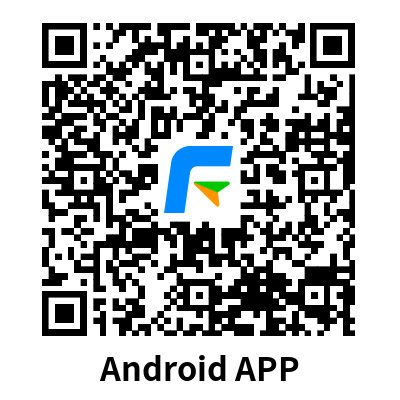

# Trung Tâm Tài Liệu Sản Phẩm

Chào mừng bạn đến với Trung Tâm Tài Liệu Sản Phẩm của chúng tôi, nơi bạn có thể tìm thấy hướng dẫn sử dụng chi tiết cho tất cả các sản phẩm và dịch vụ của chúng tôi.

## Sản Phẩm Của Chúng Tôi

### Nền tảng FleetGoo
Cung cấp khả năng quản lý toàn diện với "phần cứng + phần mềm + thuật toán AI + giải pháp" cho người dùng đội xe thương mại toàn cầu, bao gồm theo dõi phương tiện thời gian thực, phân tích dữ liệu và lập lịch trình thông minh.

### Ứng Dụng Di Động
  

### Nền tảng Mở
Tài liệu API hoàn chỉnh và hướng dẫn tích hợp cho các nhà phát triển bên thứ ba.

### Sổ Tay Sản Phẩm Phần Cứng
Hướng dẫn chi tiết về cài đặt và cấu hình sản phẩm.

## Liên Hệ Chúng Tôi

Nếu bạn cần bất kỳ hỗ trợ nào, vui lòng [liên hệ với chúng tôi](support/contact.md).
