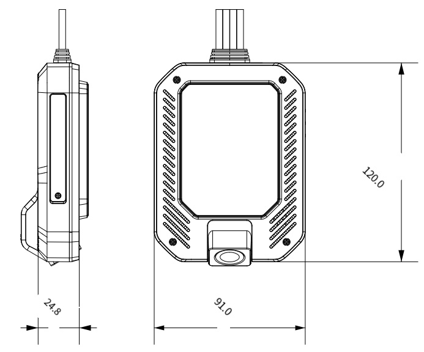
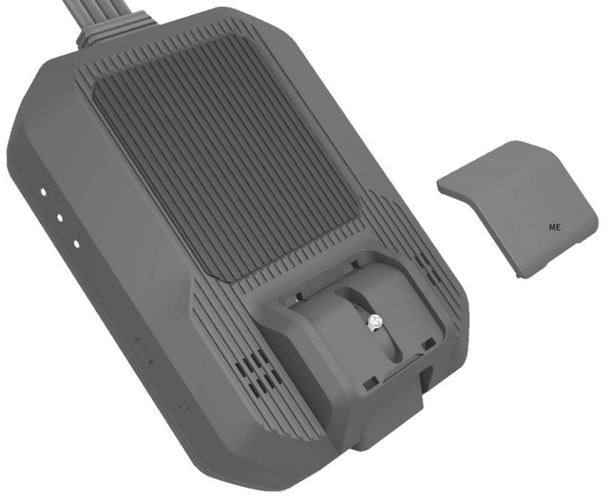
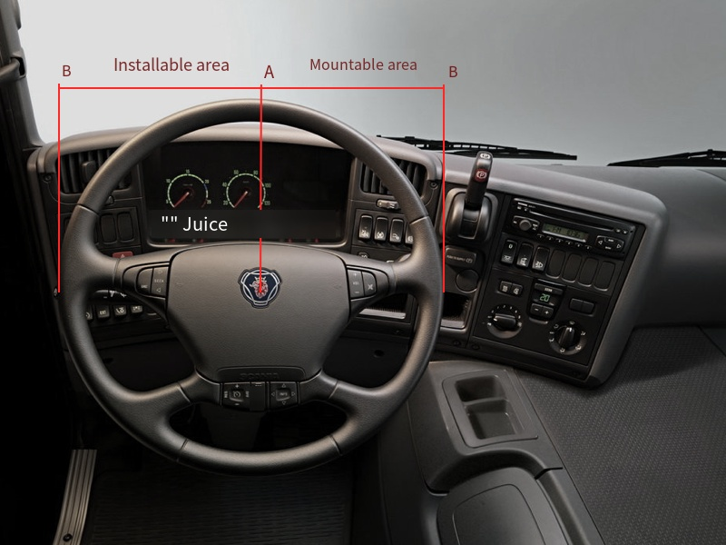

# Sổ Tay Sản Phẩm D501

> Máy ghi hình phương tiện IoT D501 là thiết bị cao cấp cấp độ ô tô được thiết kế cho quản lý đội xe và giám sát phương tiện. Tích hợp các thuật toán ADAS/DMS tiên tiến, hỗ trợ lưu trữ video đám mây đa kênh, truyền thông 4G/5G và định vị độ chính xác cao cấp độ centimet, cung cấp khả năng an toàn và hiệu quả vận hành xuất sắc cho các ứng dụng phương tiện thương mại khác nhau.

## 1. Tổng Quan Sản Phẩm

### 1.1 Giới Thiệu Sản Phẩm

Máy ghi hình phương tiện IoT D501 được thiết kế để đáp ứng các yêu cầu nghiêm ngặt trong các ngành công nghiệp khác nhau. Nó áp dụng chip xử lý hình ảnh cấp độ ô tô chuyên nghiệp hiệu suất cao và hệ điều hành Linux, đảm bảo hoạt động ổn định trong môi trường công nghiệp từ -20°C đến 70°C. Tích hợp Hệ Thống Hỗ Trợ Người Lái (ADAS) và Hệ Thống Giám Sát Tài Xế (DMS) tiên tiến. Sử dụng công nghệ tốc độ khung hình biến AI, D501 hỗ trợ lưu trữ đám mây toàn diện cho video đa kênh. Nó cũng có truyền thông mạng đầy đủ 4G/5G và định vị độ chính xác cao RTK cấp độ centimet.

### 1.2 Tính Năng Chính

- Hỗ trợ luồng video 2K + dual 1080p
- Chip cấp độ ô tô, dải nhiệt độ hoạt động công nghiệp từ -20°C đến 70°C
- Công nghệ lưu trữ đám mây video tốc độ khung hình biến AI để lưu trữ đám mây video đa kênh toàn diện
- Truyền thông mạng đầy đủ 4G/5G
- Định vị độ chính xác cao Beidou/GPS/RTK cấp độ centimet
- Tích hợp các thuật toán ADAS/DMS/BSD
- Hỗ trợ hiệu chuẩn ADAS từ xa và tự động, theo dõi lỗi thời gian thực, cấu hình tham số từ xa, v.v.
- Tuân thủ các tiêu chuẩn Bộ 794, 808 và các tiêu chuẩn giao thức liên quan
- Hỗ trợ đầu vào điện áp rộng 9-36V cho phương tiện, với bảo vệ mạch đầy đủ (thấp áp, đoản mạch, kết nối ngược)

## 2. Chi Tiết Sản Phẩm

### 2.1 Ưu Điểm Sản Phẩm

| Ưu Điểm | Chi Tiết |
| :----- | :----- |
| Hình Ảnh Siêu Nét | Hỗ trợ lên đến 2K + dual 1080p hoặc 2K + 1080p + dual 720p chất lượng video siêu nét. Sử dụng mã hóa H.265 và định dạng luồng video TS để đảm bảo hình ảnh rõ nét và ổn định. |
| Lưu Trữ Đám Mây | Cung cấp ghi hình đám mây video liên tục đa kênh và lưu trữ đám mây video sự kiện chính, cho phép người dùng phát lại và chia sẻ video trực tuyến thuận tiện bất cứ lúc nào, đạt được giám sát phương tiện toàn diện. |
| Tiêu Chuẩn Ngành | Tuân thủ các tiêu chuẩn Bộ 794/808/1076/1078 và các tiêu chuẩn giao thức khác. Có khả năng O&M thông minh bao gồm phát hiện lỗi, truy vấn và cấu hình tham số từ xa, cải thiện an toàn phương tiện và hiệu quả quản lý. |
| Truyền Thông Mạng Đầy Đủ 4G/5G | Hỗ trợ truyền thông mạng đầy đủ 4G và 5G (tùy chọn), cung cấp tốc độ kết nối mạng nhanh hơn và truyền tín hiệu ổn định hơn, cho phép giám sát thời gian thực và truyền dữ liệu liền mạch. |
| Định Vị Độ Chính Xác Cao | Hỗ trợ định vị đa chế độ GPS/Beidou Gen-2/Beidou Gen-3/GLONASS, với định vị độ chính xác cao RTK tùy chọn, đạt được định vị độ chính xác cao và theo dõi quỹ đạo phương tiện, cải thiện quản lý phương tiện và giám sát an toàn. |
| Điện Áp Rộng | Hỗ trợ đầu vào điện áp rộng 9-36V cho phương tiện, với chức năng bảo vệ thấp áp pin, đoản mạch và kết nối ngược, đảm bảo hoạt động ổn định của thiết bị và sử dụng an toàn. |
| Hệ Thống DMS | Được trang bị Hệ Thống Giám Sát Tài Xế (DMS), có khả năng phát hiện mệt mỏi nhắm mắt, ngáp, hút thuốc, gọi điện thoại, mất tập trung, che khuất và các hành vi khác của tài xế, kịp thời xác định rủi ro an toàn và cải thiện an toàn lái xe. |
| Hệ Thống ADAS | Hệ Thống Hỗ Trợ Người Lái (ADAS) bao gồm cảnh báo lệch làn, cảnh báo va chạm phía trước, cảnh báo khoảng cách an toàn và chức năng phát hiện người đi bộ, cung cấp hỗ trợ lái xe thông minh và hiệu quả giảm thiểu rủi ro tai nạn giao thông. |
| Báo Động SOS Một Nút | Chức năng báo động SOS một nút cho phép phản ứng nhanh với tai nạn phương tiện và tình huống khẩn cấp, đảm bảo hỗ trợ và cứu hộ kịp thời, từ đó cải thiện an toàn lái xe và bảo vệ tài xế/chủ xe. |

### 2.2 Thông Số Kỹ Thuật

| STT | Mục | Thông Số Kỹ Thuật |
| :---- | :---- | :---- |
| 1 | Hệ Điều Hành | Linux 4.19 |
| 2 | CPU | Quad-core Cortex-A7 1.5GHz |
| 3 | Bộ Nhớ | 4Gb DDR + 4Gb NAND Flash |
| 4 | NPU | 2.0 TOPS |
| 5 | Bộ Nhớ Mở Rộng | 1 khe cắm thẻ TF, hỗ trợ lên đến 512GB |
| 6 | Video | Mã hóa H.265, ghi hình luồng TS, khả năng codec: 5MP@30fps |
| 7 | Âm Thanh | Mã hóa G.711A, hỗ trợ ghi âm, phát thanh và liên lạc |
| 8 | Camera Trước | Giao diện MIPI, hỗ trợ 2560x1440@30fps |
| 9 | Camera Sau | Hai cổng AHD, hỗ trợ 1080P@25fps |
| 10 | Dữ Liệu Video (Tốc Độ Bit) | 1080P: 25fps@4Mbps (luồng chính); 720P: 20fps@2Mbps (luồng chính); 720P/540P: 16fps@800Kbps (luồng phụ) |
| 11 | Mạng Truyền Thông | Hỗ trợ đầy đủ 4G, hỗ trợ đầy đủ 5G (tùy chọn), ăng-ten tích hợp |
| 12 | Thẻ SIM | 1 khe cắm thẻ SIM (hỗ trợ thẻ IC cắm hoặc thẻ Micro SIM bên ngoài) |
| 13 | Wi-Fi | 802.11b/g/n 2.4GHz, ăng-ten tích hợp |
| 14 | Cảm Biến | Con quay hồi chuyển sáu trục |
| 15 | Nút | 2 nút: Nút đặt lại thiết bị, nút SOS bên ngoài |
| 16 | Micro | 1 micro độ nhạy cao |
| 17 | Loa | Loa tích hợp 8Ω/1W |
| 18 | Đèn Báo | Ba đèn báo cho ghi hình video, định vị GPS và trạng thái mạng |
| 19 | Cổng Nối Tiếp | 1 cổng nối tiếp RS232 tùy chọn |
| 20 | GPIO | Hỗ trợ lên đến ba kênh GPIO |
| 21 | Điện Áp Hoạt Động | 9V~36V |
| 22 | Dòng Điện Hoạt Động | 500mA ở 12V |
| 23 | Dòng Điện Sleep | 20mA ở 12V |

### 2.3 Chức Năng Cơ Bản

| Chức Năng Sản Phẩm | Mô Tả |
| :---- | :---- |
| Ghi Hình Vòng Lặp | Ghi hình video được chia thành ghi hình bình thường và ghi hình khẩn cấp, được ghi đè vòng lặp trên thẻ lưu trữ TF theo tỷ lệ dung lượng được đặt trước. |
| Chụp Sự Kiện | Được kích hoạt bởi sự kiện hoặc lệnh từ xa, hỗ trợ chụp một hoặc nhiều hình ảnh/video và tải lên đám mây. Chụp bao gồm 7 giây trước sự kiện và 8 giây sau sự kiện. |
| Lưu Trữ Đám Mây Sự Kiện | Hình ảnh/video được kích hoạt bởi chụp hoặc sự kiện được tải lên đám mây để lưu trữ vĩnh viễn. |
| Ghi Hình Khẩn Cấp | Khi sự kiện được kích hoạt, tệp ghi hình hiện tại bị khóa là ghi hình khẩn cấp. Hình ảnh chụp hoặc clip video (7 giây trước sự kiện, 8 giây sau sự kiện) được tải lên đám mây. |
| Xem Trước Thời Gian Thực Từ Xa | Hỗ trợ xem một hoặc nhiều kênh video thời gian thực trên điện thoại di động hoặc nền tảng. |
| Phát Lại Từ Xa | Hỗ trợ phát lại một hoặc nhiều kênh video lịch sử trên điện thoại di động hoặc nền tảng. |
| Xem Trước Wi-Fi | Hỗ trợ kết nối với điện thoại di động qua Wi-Fi trong xe để xem trước video thời gian thực. |
| Phát Lại Wi-Fi | Hỗ trợ kết nối với điện thoại di động qua Wi-Fi trong xe để phát lại video lịch sử. |
| Giám Sát Đỗ Xe | Sau khi phương tiện tắt, hỗ trợ xem hình ảnh thời gian thực hoặc chụp từ xa. Nếu xảy ra bất thường như rung động hoặc va chạm, điện thoại di động có thể được thông báo chủ động. |
| Theo Dõi Quỹ Đạo | Báo cáo định kỳ thông tin định vị phương tiện như vĩ độ và kinh độ. |
| Phát Lại Quỹ Đạo | Xem quỹ đạo lái xe cho một ngày cụ thể hoặc khoảng thời gian. |
| Tải Lên Dữ Liệu Ngoại Tuyến | Khi phương tiện ngoại tuyến, lưu trữ 10.000 dữ liệu định vị mới nhất và tự động tải lên sau khi kết nối mạng. |
| Giám Sát Giọng Nói | Nền tảng có thể giám sát âm thanh trong xe từ xa. |
| Liên Lạc Giọng Nói | Nền tảng hỗ trợ liên lạc giọng nói hai chiều với phương tiện. |
| Báo Động Thấp Áp | Khi điện áp phương tiện thấp hơn ngưỡng được đặt trước, báo cáo báo động thấp áp và cắt nguồn máy chủ. |

### 2.4 Ngoại Hình Sản Phẩm

### 2.5 Hình Bùng Nổ Sản Phẩm

*Hình 5: Hình bùng nổ sản phẩm*

### 2.6 Kích Thước Sản Phẩm

**Bảng 4: Kích Thước Sản Phẩm**

| Tên | Kích Thước |
| :---- | :---- |
| Máy Chủ D501 | 120 * 91 * 24.8 mm |

*Hình 6: Sơ đồ kích thước sản phẩm*

### 2.7 Định Nghĩa Đèn Báo

| Màu | Trạng Thái | Ghi Hình Video | Mạng | Định Vị GPS |
| :---- | :---- | :---- | :---- | :---- |
| Xanh Dương | Flash chậm | Bình thường | Tắt | Tắt |
|  | Sáng liên tục | Tắt | Bình thường | Tắt |
| Vàng-Xanh Lá | Flash chậm | Tắt | Tắt | Bình thường |
| Cam-Đỏ | Flash chậm | Tắt | Bất thường | Tắt |
|  | Sáng liên tục | Tắt | Tắt | Bất thường |

## 3. Hướng Dẫn Cài Đặt

Để đảm bảo cài đặt trơn tru, hiệu quả và đầy đủ, vui lòng làm theo các bước sau:

- Xác định điểm đi dây tốt nhất, cụ thể là xác định vị trí hộp cầu chì phương tiện và điểm nối đất phù hợp
- Xác định vị trí cài đặt lý tưởng cho máy ghi hình D501 và các camera khác
- Lập kế hoạch chiến lược đi dây: tích hợp với hệ thống dây hiện có của phương tiện hoặc chọn tuyến đường đi dây riêng ẩn
- Bắt đầu đi dây từ vị trí cài đặt máy ghi hình dựa trên các điều kiện trên
- Sau khi đi dây hoàn tất và xác nhận cấp nguồn, gửi hình ảnh cài đặt và thông tin liên quan cho nhân viên backend (nếu áp dụng) để xác thực dữ liệu. Sau khi xác nhận, lắp ráp lại các tấm trang trí phương tiện, lắp đặt chắc chắn máy ghi hình và hoàn thành cài đặt

### 3.1 Các Bước Cài Đặt

**Lưu Ý Cài Đặt:**

- Đảm bảo cài đặt chắc chắn và chống thấm nước. Tránh các khu vực nhiệt độ cao và nguồn nhiễu từ (như đầu CD ô tô, loa âm thanh, máy tính phương tiện, radio ô tô)
- Đảm bảo vị trí cài đặt trên kính chắn gió nằm trong phạm vi cần gạt nước để duy trì tầm nhìn rõ ràng, ngay cả trong ngày mưa. Nó nên được đặt gần gương chiếu hậu để tầm nhìn tốt nhất
- Không chạm vào ống kính bằng ngón tay của bạn, vì dầu mỡ sẽ để lại vết, gây ra video mờ hoặc biến dạng hình ảnh
- Trong quá trình cài đặt, đảm bảo tất cả các giao diện cắm được kết nối đúng và chắc chắn. Để bảo vệ thêm, quấn các kết nối bằng băng điện để ngăn nước vào, oxy hóa và ngắt kết nối vô tình. Đảm bảo dây được ẩn để tránh chặn tầm nhìn của tài xế và duy trì tính thẩm mỹ

#### Bước 1: Chèn Thẻ

Chèn thẻ TF và thẻ SIM vào thiết bị, sau đó cố định nắp thẻ.

*Hình 7: Chèn thẻ TF và thẻ SIM*

#### Bước 2: Chọn Điểm Cài Đặt

Chọn điểm cài đặt phù hợp cho máy chủ. Làm sạch kỹ khu vực.剥离 lớp bảo vệ của băng dính 3M trên giá đỡ máy ghi hình, và gắn chắc chắn giá đỡ vào kính chắn gió, giữ trong 2 phút.

*Hình 8: Vị trí cài đặt máy chủ (chọn vị trí cài đặt phù hợp dựa trên điều kiện thực tế như mẫu phương tiện, môi trường địa điểm và yêu cầu của khách hàng)*

#### Bước 3: Định Tuyến Dây Nguồn

Tháo các tấm trang trí trong khu vực cài đặt. Khi định tuyến dây nguồn, hướng nó dọc theo trụ A như chỉ dẫn cho các mẫu phương tiện điển hình.

*Hình 9: Đường đi dây điển hình (nếu điều kiện thực tế khác, chọn vị trí đi dây hợp lý)*

#### Bước 4: Cố Định Camera Trước

Sau khi đặt góc camera trước, cố định nó bằng cách vặn chặt các vít dưới tấm nắp của nó. Điều này ngăn chặn rung động hoặc điều chỉnh vô tình hướng ống kính trong khi lái xe.

*Hình 10: Cố định camera trước*

#### Bước 5: Cài Đặt Camera DMS

Vị trí cài đặt camera DMS nên tuân theo các nguyên tắc sau:

- **Vị Trí Cài Đặt:** Khuyến nghị cài đặt trên bảng điều khiển trung tâm hoặc bảng đồng hồ
- **Góc và Khoảng Cách Cài Đặt:** Đảm bảo tài xế nằm trong ±30° phía trước camera. Góc khuyến nghị nên nhỏ nhất có thể. Khoảng cách khuyến nghị giữa camera và khuôn mặt tài xế là 60-120cm, lý tưởng là khoảng 80cm
- **Chính Giữa:** Đảm bảo khuôn mặt tài xế ở chính giữa tầm nhìn camera DMS (có thể xác nhận qua APP di động)
- **Không Bị Che Khuất:** Đảm bảo camera DMS không chặn tầm nhìn của tài xế hoặc can thiệp vào việc lái xe
- **Tầm Nhìn Rõ Ràng:** Đảm bảo không có vật thể nào (như vô lăng) chặn tầm nhìn giữa camera DMS và khuôn mặt tài xế
- **Căn Chỉnh Mức:** Camera DMS nên được cài đặt ngang và không được nghiêng
- **Góc Tối Ưu:** Trong các điều kiện trên, góc lệch giữa camera DMS và khuôn mặt tài xế càng nhỏ càng tốt. Lý tưởng là nó nên chỉ trực tiếp vào tài xế

*Hình 11: Hướng dẫn cài đặt camera DMS (nếu điều kiện thực tế khác, chọn vị trí cài đặt và cố định hợp lý)*

### 3.2 Hướng Dẫn Đi Dây

Định tuyến dây nguồn đến hộp cầu chì. Kết nối dây ACC và dây nguồn liên tục với các khe cầu chì tương ứng. Kết nối dây GND trực tiếp với điểm nối đất phù hợp (như bu lông kim loại trên khung xe).

*Hình 12: Sơ đồ đi dây*

| STT | Màu Dây | Mô Tả |
| :-- | :-- | :-- |
| 1 | Vàng | Cực dương nguồn (B+) |
| 2 | Đen | Cực âm nguồn (GND) |
| 3 | Đỏ | ACC (Phụ kiện/Công tắc đánh lửa) |

**Lưu Ý Đi Dây:**

- Tháo cầu chì tương ứng gốc của phương tiện và thay thế bằng cầu chì của dây nguồn
- Thiết bị thường được trang bị cầu chì 15A. Không thay thế nó bằng cầu chì thấp hơn 15A
- Dây ACC (đỏ) kiểm soát trạng thái sleep/wake của thiết bị. Không kết nối dây ACC với nguồn liên tục
- Dây nguồn liên tục được kết nối với cực dương (B+) nên duy trì ít nhất 12V khi tắt công tắc đánh lửa

## 4. Lĩnh Vực Ứng Dụng và Người Dùng Mục Tiêu

| Danh Mục | Chi Tiết |
| :---- | :---- |
| **Lĩnh Vực Ứng Dụng** | Ngành Internet of Vehicles (IoV) |
| **Trường Hợp Sử Dụng Điển Hình** | Taxi, xe gọi xe, xe vận tải hành khách, xe chở hàng, logistics đô thị, xe kỹ thuật, v.v. |
| **Người Dùng Mục Tiêu** | Các phòng quản lý taxi/xe gọi xe/xe chở hàng/xe vận tải hành khách, công ty cho thuê xe, quản lý đội xe, v.v. |
| **Thách Thức Được Giải Quyết** | D501 cung cấp cho người dùng khả năng trực quan hóa và quản lý thông minh, đạt được giám sát từ xa tập trung, quản lý từ xa và thu thập, phân tích dữ liệu phương tiện toàn diện. Điều này cho phép giám sát thời gian thực trạng thái phương tiện và tài xế, giúp ngăn ngừa lái xe mệt mỏi, giảm rủi ro tai nạn và đảm bảo an toàn tài xế và phương tiện. |

## 5. FAQ

| Vấn Đề/Lỗi | Giải Pháp |
| :---- | :---- |
| Thiết bị bị rơi | Đảm bảo kính xe được làm sạch kỹ và băng 3M được ép chắc chắn. Nếu cần, thay thế băng 3M. |
| Máy ghi hình không bật nguồn | Vui lòng xác nhận rằng dây nguồn chính (như giao diện BMW) được cắm chắc chắn, dây nguồn được kết nối đúng và đảm bảo nguồn điện bên ngoài hoạt động bình thường. |
| Ghi hình video không bắt đầu sau khi bật nguồn | Đầu tiên đảm bảo thẻ TF được chèn đúng. Nếu không, vui lòng chèn lại thẻ TF sau khi thiết bị tắt nguồn. Nếu các bước này thất bại, vui lòng định dạng thẻ TF hoặc thay thế bằng thẻ TF mới. |
| Ghi hình kết thúc bất thường | Vui lòng định dạng thẻ TF hoặc thay thế bằng thẻ TF đáp ứng yêu cầu (Class 10 trở lên). |
| Hình ảnh video mờ | Vui lòng đảm bảo không có vết bẩn trên kính chắn gió xe. Vui lòng đảm bảo không có vết bẩn hoặc vật cản trên ống kính camera máy ghi hình. |
| Máy ghi hình không phản hồi | Vui lòng ngắt nguồn và khởi động lại máy ghi hình. Hoặc nhấn nút đặt lại của thiết bị để tự động khởi động lại máy ghi hình. |
| Thiết bị đầu cuối ngoại tuyến | Kiểm tra xem thẻ SIM có hết tiền không; nếu có, vui lòng liên hệ nhà mạng để thanh toán. Kiểm tra xem thẻ SIM có tiếp xúc tốt không: chèn lại thẻ SIM. Nếu phương tiện ở khu vực có tín hiệu yếu, như bãi đỗ xe ngầm hoặc đường hầm, vui lòng di chuyển đến khu vực có tín hiệu tốt hơn. |
| Thiết bị đầu cuối không định vị | Đảm bảo giao diện kết nối ăng-ten được cắm chắc chắn. Kiểm tra xem bề mặt ăng-ten có hướng lên không: điều chỉnh lại vị trí ăng-ten. Nếu phương tiện ở bãi đỗ xe ngầm, đường hầm hoặc khu vực khác không có tín hiệu, vui lòng lái ra khỏi khu vực. |

## 6. Lưu Ý Quan Trọng

| STT | Lưu Ý |
| :-- | :-- |
| 1 | Sản phẩm điện tử yêu cầu chú ý cẩn thận đến chống thấm nước. |
| 2 | Đảm bảo pin phương tiện luôn được sạc đầy. |
| 3 | Khuyến nghị tắt thiết bị khi nhiệt độ môi trường vượt quá dải nhiệt độ hoạt động. |
| 4 | Trong bãi đỗ xe ngầm, đường hầm hoặc nhà để xe, tín hiệu định vị GPS và tín hiệu mạng truyền thông có thể bị ảnh hưởng, có thể ngăn thiết bị giám sát. Sau khi phương tiện rời khỏi các khu vực như vậy, thiết bị sẽ tự động khôi phục hoạt động bình thường. |
| 5 | Không cố tự sửa chữa trong điều kiện bất thường. Thiệt hại do kết nối phụ kiện không chính hãng hoặc ngắt kết nối các thành phần bên trong không được bảo hành của nhà sản xuất. |
| 6 | Do điều kiện môi trường và phương tiện khác nhau, một số tính năng có thể không được hỗ trợ. Hiệu suất sản phẩm có thể được tăng cường thông qua nâng cấp firmware không thường xuyên mà không cần thông báo trước. |
| 7 | Mặc dù sản phẩm này có thể ghi và lưu hình ảnh/video của tai nạn phương tiện, nhưng không đảm bảo ghi lại tất cả cảnh quay tai nạn. Va chạm nhỏ có thể không kích hoạt cảm biến va chạm, nghĩa là cảnh quay có thể không được lưu vào thư mục sự kiện đặc biệt. |
| 8 | Hãy chắc chắn tắt nguồn thiết bị trước khi chèn hoặc tháo thẻ lưu trữ TF. |
| 9 | Để hoạt động ổn định của sản phẩm, khuyến nghị định dạng thẻ lưu trữ ít nhất hai tuần một lần. |
| 10 | Thẻ TF có tuổi thọ dịch vụ hạn chế. Sử dụng lâu dài có thể dẫn đến hỏng dữ liệu hoặc không thể lưu dữ liệu. Trong trường hợp này, khuyến nghị mua thẻ TF mới. Công ty không chịu trách nhiệm về mất dữ liệu do sử dụng lâu dài thẻ lưu trữ hoặc hao mòn tự nhiên. |
| 11 | Không kết nối nguồn điện liên tục (UPS) mà không được ủy quyền, vì điều này có thể gây ra lỗi phương tiện hoặc sản phẩm. Nếu bạn có câu hỏi cài đặt hoặc cần hỗ trợ chuyên nghiệp, hãy chắc chắn tham khảo ý kiến chuyên gia đủ điều kiện. |
| 12 | Sản phẩm này được thiết kế như công cụ hỗ trợ lái xe an toàn. Tất cả dữ liệu được ghi, bao gồm video và âm thanh, chỉ dành cho tham khảo phụ trợ. Công ty chúng tôi không chịu trách nhiệm về bất kỳ lỗi hoặc mất dữ liệu nào do vận hành thiết bị không đúng hoặc các yếu tố bên ngoài ngoài tầm kiểm soát của chúng tôi. |
